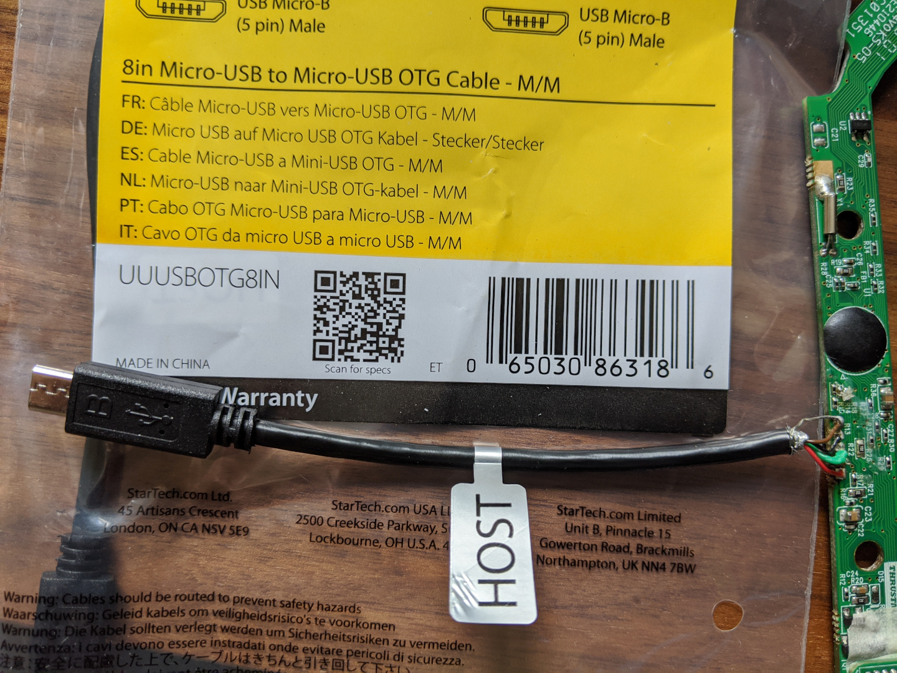

# F/A-18C Hornet AMPCD Project
### Introduction
I wanted to achieve a AMPCD (MFD) for the DCS F/A-18C hornet which made use of the [Thrustmaster Cougar MFD](http://www.thrustmaster.com/products/mfd-cougar-pack).  This is a description of the path I took, and the rationale for that route.

### Design Choices
I have seen a few android solutions to MFDs, and there was a lot of merit to this platform based on the availability of second hand android tablets.  I think that the ideal size of tablet to fit the internal space of the cougar MFD is probably about 8 inches, and these are readily available, but this would probably have led me to use the android tablet with some USB display emulation software and
and I wanted to have a stand alone device if at all possible.  In the end, I decided to base the project on a windows tablet so that I could make use of the flexibility of [Helios](https://github.com/HeliosVirtualCockpit/Helios) which is an active open source virtual cockpit system which supports DCS.
This approach also had the benefit that I could attach the Cougar MFD directly to the tablet.  The tablet I chose was the original Linx 10 because I found a seller on eBay would was selling multiple working tablets second hand tablets for around 35 USD each.  The Linx 810/820 tablets were a lot more expensive, and while the
Linx 10 did not come with keyboard or power supply, I thought that this was a reasonable starting place.
### Parts
* 1 x Thrustmaster Cougar MFD
* 1 x 8in Micro-USB to Micro-USB OTG Cable (eg StarTech UUUSBOTG8IN)		
* alternative 1 x Micro USB OTG adapter
* 1 x Linx 10 windows tablet (screen resolution 1280 x 800)
* 3D printed brackets to hold the MFD onto the tablet
* 1 x Latest version of Helios Virtual Cockpit (in my case the 32 bit version) and install IRIS client
* 1 x Latest Hornet AMPCD profile for Helios

#### Notes on the Tablet
* There are several variants of the 10 inch Linx windows tablets.  This project is based on the original Atom Z3735F processor (Bay Trail) which should mean that other variants of the 10 inch tablet will work better because they have better processors and graphics.  However the
the original Linx 10 works perfectly well.  I had expected the Windows 8.1 installed on the tablet to be 64 bit, but unfortunaltely it was only 32 bit (the processor can run 64 bit), however I was lucky enough that the tablet still upgraded to Windows 10 (again 32 bit) under the supposedly expired free upgrade programme.
* I always expected to run the tablet as a dedicated device, so I am not worried about the limited storage, although the table does have a micro SD card reader.
* The main challenge with using a tablet for this type of activity is that it is exclusively battery powered - meaning that when you plug in the charger - it charges the battery and does not power the tablet.  I do intent to remove the battery at some point and power the tablet by cable as this suits my needs better
but I have not done this yet.  The other issue is a lesser one, which is that if you're integrating the tablet in a simpit, then you will probably find it challenging to access the power button on the top edge of the tablet.
* **Caution** I did watch one [YouTube](https://www.youtube.com/watch?v=WEbMrJMwE2g) video showing a tear down of the tablet.  In the video he described it as difficult to get into the tablet, which led my first attempt to use un-necesary force and I cracked the digitizer.  While attempting to remove the digitizer, I then broke the LCD.  In my experience, the Linx 10 
is quite easy to open, and it you find that you're needing to use a little force, then my experience says that you're probably doing it wrong.  Probably the only reason to open the tablet is if you are intending to power it directly, and you will obviously be doing this at your own risk.      

### Changing the Cougar MFD to MicroUSB connector
This is not absolutely necessry, an "On The Go" OTG adaptor will work perfectly well.  Why I changed the connector was for two reasons.  Firstly, I wanted a shorter cable, and secondly the adaptor took up space.  I tried several options when I was experimenting, but in the end, I opted for the StarTech cable because it was long enough when cut in half, and I was also hoping to do two MFDs with a single cable.  The StarTech cable comes with one end marked "Host" and this is the end to use.  It might be possible to use the other end, but I have not tried this yet.  The reason why an OTG is necessary is because 
the Micro USB connector has an ID pin, and this needs to be tied to GND in order to convince the tablet that it needs to be a host.  My StarTech cable has a 5th conductor (brown) which appears to be the "ID" pin.  Again, I have not investigated this yet, but it is possible that the green and white wires might need to be reversed if the non-host end is used.  These cables are very cheap so it should not be the ned of the world if you have to buy two.  I also think that there is the potential for cables from other sources to have the ID pin held low inside the
connector which would mean that the cable would definitely only work if using the host end.  My MFDs did not have a connector for the cable inside the device, so to change the cable, you will need to be proficient at soldering, and have a reasonably small tip on the iron.  Also, be aware that at least in my MFD's Thrustmaster had used non-standard cable colours.  The MFD I changed seemed to be made in 2018, but the PCB desing with 2009.  It is possible that connections for other revisions of the PCB could have different configuration.  Check out the connections before heating up the iron ;-)

#### The new colours for the connections
* Red		+5v	(square pad)
* White		D-
* Green		D+
* Black		GND
* Brown		ID

### Other Activities
* Configure the tablet to have a static IP address. 
* Create an account without a password to run Helios (it is a pain to type a password when the MFD is on the screen)
* Useful to have a shortcut on the desktop to shut down the tablet
* Run IRIS server on your DCS machine to export your AMPCD viewport to the tablet
* Install the latest Thrustmaster Driver
* About GUID - There is problem when configuring the MFD in a Helios profile in the profile editor, and then using that profile on another computer.  There is a fix for this in Helios, but to date, it has not made it into a generally available release.  There is also a 
quick and dirty fix which is to run the Helios profile editor on the tablet, add the MFD, save the profile.  You can then extract the GUID from that profile and substitute the one that is currently in the Hornet AMPCD profile for the GUID of yout MFD which is connected to the tablet. 
